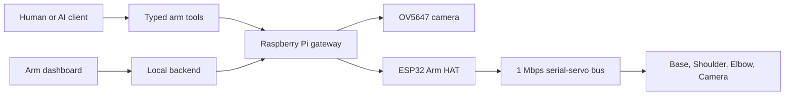

# co-arm

`co-arm` is a four-joint desktop camera arm made so Codex can look around a
real desk and move the camera when it needs a better angle. Basically, the goal
is to connect AI reasoning to a real camera and arm without hiding the safety
checks or pretending that a command automatically worked.

This repo documents the build as it develops, including the hardware,
electronics, software, CAD, tests, and the parts that still need physical
proof.

The Raspberry Pi handles the camera, API, geometry, calibration, and motion
rules. An ESP32 on the servo HAT handles the real-time servo bus, watchdogs,
STOP state, torque leases, and torque-off behavior.

> **Important:** This is a working prototype, not a certified robot, safety
> controller, finished product, or plug-and-play kit. Keep it supervised,
> support the links whenever torque might turn off, keep the movement area
> clear, and keep a physical servo-power cut within reach. The software STOP is
> useful, but it is not the same as physically cutting power.

## The current build

| Part | Reference build |
| --- | --- |
| Driven joints | Base, Shoulder, Elbow, and Camera |
| Main servos | 3 x ST3215/STS-family serial-bus servos |
| Camera servo | SC09/SCS-family serial-bus servo |
| Base transmission | 4:1 external gearing |
| Gateway | Raspberry Pi 4 |
| Servo controller | ESP32 on a Waveshare Bus Servo Driver HAT (A) |
| Camera | Raspberry Pi Camera Module 1 Rev 1.3 / OV5647, fixed focus |
| Measured geometry | 60 mm pivot height, 180 mm upper arm, 220 mm elbow-to-tip |
| Current controller line | `arm-hat-2.4.0`, native Mode-0 absolute Base control |

The Camera joint is the fourth driven joint. It aims the sensor, but it is not
part of the two-link Shoulder and Elbow inverse kinematics.

## How it is connected



The basic path is the laptop or AI tools to the Raspberry Pi, then the Pi talks
to the ESP32 Arm HAT, and the HAT controls the serial-bus servos. The Pi also
owns the camera and the higher-level movement checks.

## Clone it and let Codex guide you

The fun way to use this repo is to clone it, open the folder in Codex, say what
hardware is connected, and let Codex walk through the setup with you. The repo
includes [`AGENTS.md`](AGENTS.md) plus a dedicated
[human and AI setup guide](docs/SETUP_WITH_CODEX.md), so the same checklist can
be followed by a person or an agent.

You need Git and Python 3.10 or newer. The checker has no third-party Python
dependencies.

```bash
git clone https://github.com/over-TT/co-arm.git
cd co-arm
python tools/check_repo.py
```

Then open the `co-arm` folder in Codex and paste this:

```text
Help me set up co-arm from this checkout. Read AGENTS.md,
docs/SETUP_WITH_CODEX.md, docs/STATUS.md, docs/KNOWN_LIMITATIONS.md,
docs/CONTROL_AND_SAFETY.md, and docs/COMMISSIONING.md before acting.

My Raspberry Pi is [not connected / connected over SSH at <host>]. Start by
checking what files and hardware are actually available. Begin with read-only,
no-motion checks. Ask me only for critical missing hardware facts. Do not move
the arm, release torque, change wiring, flash firmware, deploy services, or
disable a guard until you show me the exact step and I approve it. Keep source
checks, live telemetry, command acceptance, physical arrival, and camera proof
separate. Maintain a setup checklist as we go.
```

Codex should first explain what can be completed from the current checkout,
check the Raspberry Pi without moving anything, and stop at any step that needs
a real hardware fact or deliberate approval.

### What works from this checkout today

This is currently a documentation-first release. It is enough for Codex to:

- explain the architecture and evidence model;
- audit parts, labels, wiring plans, CAD folders, and the BOM;
- prepare a build-specific checklist;
- guide safe Raspberry Pi SSH and camera discovery;
- identify the next missing file or owner decision;
- walk through commissioning in the correct order.

The portable firmware, Pi gateway, MCP server, and standalone dashboard source
have not been released into this repo yet. That means this checkout cannot yet
perform a one-command install, flash, or deployment. Codex must detect that
boundary instead of inventing commands. The source release status is tracked in
[`software/README.md`](software/README.md).

## Raspberry Pi first connection

If a Pi is already connected, keep the servo rail off and support the arm before
starting. Logic-only discovery can begin without authorizing firmware changes
or movement.

1. For a new Pi, install Raspberry Pi OS and enable SSH through
   [Raspberry Pi Imager](https://www.raspberrypi.com/documentation/computers/getting-started.html#install-using-imager).
2. Connect from the computer that has the repo:

   ```bash
   ssh <pi-user>@<pi-host>
   ```

3. Run the read-only checks below on the Pi:

   ```bash
   uname -a
   cat /etc/os-release
   python3 --version
   rpicam-hello --list-cameras
   ```

   Raspberry Pi's official [SSH guide](https://www.raspberrypi.com/documentation/computers/remote-access.html#ssh)
   and [camera guide](https://www.raspberrypi.com/documentation/computers/camera_software.html)
   explain these platform-level steps.

4. Give the results to Codex, but remove usernames, hostnames, addresses, serial
   numbers, or anything else that should not enter a public issue or commit.
5. Let Codex compare the detected setup with the
   [hardware guide](docs/HARDWARE.md), [electronics guide](docs/ELECTRONICS.md),
   and [commissioning order](docs/COMMISSIONING.md).

These checks prove that SSH, the OS, Python, or camera discovery work at that
moment. They do not prove that the gateway, controller, servo bus, calibration,
or motion path is ready. Continue with the full
[human and AI setup guide](docs/SETUP_WITH_CODEX.md).

## Current proof status

The proof levels stay separate because passing a software test and moving the
real arm are not the same claim.

- Automated tests prove parts of the software, not the physical arm.
- Live telemetry proves what the controller measured at that moment.
- Sending a target does not automatically prove that the arm reached it.
- A camera frame only proves what is actually visible in that frame.
- Observed movement is physical evidence, but it is not a proper calibration
  table unless the numbers were recorded too.

By 2026-08-10, the Base configuration for native absolute multi-turn control
had been read back, and normal zero, positive, negative, and return movement
had been physically checked on the reference arm.

By 2026-08-11, the motionless plan and preview system, plus the one-use apply
contract, had been deployed. The preview path was exercised, but the newer
plan/apply movement path still needs a properly recorded physical run before it
can be called fully proved.

The complete proof list and remaining device tests are in
[Current status](docs/STATUS.md).

## What is in this repo

- [`docs/`](docs/README.md) has the detailed arm documentation, current status,
  setup flow, hardware, architecture, controls, safety, vision, assembly,
  commissioning, history, troubleshooting, and release notes.
- [`hardware/`](hardware/README.md) has the BOM and prepared folders for native
  CAD, STEP, STL, drawings, schematics, and wiring.
- [`software/`](software/README.md) explains the clean software release plan and
  has prepared folders for the firmware, Pi gateway, MCP server, and dashboard.
- [`media/`](media/README.md) is where approved photos, diagrams, and video
  links will go.
- [`tools/check_repo.py`](tools/check_repo.py) checks for missing files, broken
  links, private paths, device IDs, secrets, oversized files, and common things
  that should not be pushed.

The working software currently lives in a larger private workspace. Copying
that whole workspace would also copy unrelated projects, local runtime files,
generated builds, and private machine details. Clean, portable arm code will be
added to the prepared software folders after its public scope and licenses are
decided.

## Where CAD, STL files, pictures, and videos go

The folders are already laid out so the repo does not need to be reorganized
later:

1. Editable CAD goes in `hardware/cad/native/`.
2. Millimetre STEP exports go in `hardware/cad/step/`.
3. Oriented, print-ready millimetre STL files go in
   `hardware/stl/print-ready/`.
4. Dimensioned PDF or DXF drawings go in `hardware/drawings/`.
5. New unreviewed photos and videos first go in the ignored `media/raw/`
   folder.
6. After checking the background, metadata, labels, and anything personal, the
   approved files go into the matching tracked folder under `media/photos/`,
   `media/video/`, or `media/diagrams/`.

The exact file naming and export setup is in
[CAD and STL](docs/CAD_AND_STL.md). The picture and video shot list is in the
[Media guide](docs/MEDIA_GUIDE.md). There is also a simple upload checklist in
[Owner handoff](docs/OWNER_HANDOFF.md).

## If you want to reproduce it

Start with these pages:

1. [Human and AI setup guide](docs/SETUP_WITH_CODEX.md)
2. [Current status and evidence](docs/STATUS.md)
3. [Known limitations](docs/KNOWN_LIMITATIONS.md)
4. [Control and safety boundaries](docs/CONTROL_AND_SAFETY.md)
5. [Hardware inventory](docs/HARDWARE.md)
6. [Electronics and power](docs/ELECTRONICS.md)
7. [Assembly](docs/ASSEMBLY.md)
8. [Commissioning](docs/COMMISSIONING.md)

Do not blindly copy the reference calibration. Every build needs its own
geometry measurements, joint zeros, limits, gearing checks, servo checks, and a
real physical way to cut servo power.

## What is still missing

The documentation structure is ready, but the repository still needs the
actual CAD, STL files, drawings, approved pictures and videos, exact fastener
and print details, and cleaned software exports. Public attribution and
licenses also still need to be decided.

Those remaining questions are tracked in
[Open questions](docs/OPEN_QUESTIONS.md). Until a license is added, this repo
does not grant an open-source or open-hardware license. See
[Licensing](LICENSING.md) before copying, manufacturing from, or redistributing
anything.
