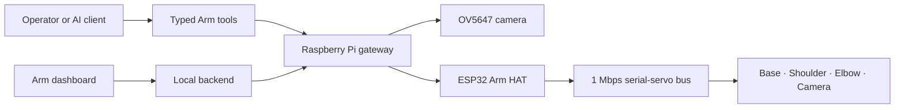

# co-arm

`co-arm` is a four-joint desktop camera arm built to give an AI system a
bounded way to observe, reason about, and reposition a physical camera. A
Raspberry Pi owns the network API, camera, geometry, and motion policy; an
ESP32 on the servo HAT owns the real-time bus, watchdogs, torque leases, STOP,
and torque-off behavior.

> This repository documents a working reference prototype. It is not a
> certified robot, safety controller, product, or turnkey build. A software
> STOP is not a physical emergency stop. Keep the arm supervised, support the
> links whenever torque may be removed, keep the sweep clear, and keep a
> physical servo-power cut within reach.

## At a glance

| Item | Reference build |
| --- | --- |
| Driven joints | Base, Shoulder, Elbow, auxiliary Camera |
| Main servos | 3 x ST3215/STS-family serial-bus servos |
| Camera servo | SC09/SCS-family serial-bus servo |
| Base transmission | 4:1 external gearing |
| Gateway | Raspberry Pi 4 |
| Servo controller | ESP32 on Waveshare Bus Servo Driver HAT (A) |
| Camera | Raspberry Pi Camera Module 1 Rev 1.3 / OV5647, fixed focus |
| Measured geometry | 60 mm pivot height, 180 mm upper arm, 220 mm elbow-to-tip |
| Current controller line | `arm-hat-2.4.0`, native Mode-0 absolute Base control |

The Camera joint aims the sensor but does not participate in the two-link
Shoulder/Elbow inverse-kinematics chain.

## What has actually been proved

The project keeps evidence tiers separate:

- Source and automated tests prove software behavior, not hardware behavior.
- Live telemetry proves what the controller measured at that moment.
- A commanded target does not prove arrival.
- A camera frame proves only what is visible in that frame.
- Operator-observed movement is physical evidence, but is not a numeric
  calibration table unless the numbers were recorded.

By 2026-08-10, the physical Base configuration for native absolute multi-turn
control had been read back and normal zero, positive, negative, and return
movement had been accepted on the reference arm. By 2026-08-11, explicit
motionless plan/preview support and one-use apply contracts were deployed; the
preview path was exercised, but the new plan/apply motion path still needs a
recorded physical application. See [current status](docs/STATUS.md) for the
complete proof matrix and open gates.

## Repository map

- [`docs/`](docs/README.md) — status, hardware, architecture, controls, vision,
  assembly, commissioning, history, troubleshooting, and release records.
- [`hardware/`](hardware/README.md) — BOM plus reserved locations for native
  CAD, STEP, STL, drawings, schematics, and wiring.
- [`software/`](software/README.md) — the public software boundary and reserved
  locations for firmware, Pi gateway, MCP, and dashboard material.
- [`media/`](media/README.md) — approved photos, diagrams, and video links.
- [`tools/check_repo.py`](tools/check_repo.py) — local and CI release check.

## Adding the files that are still missing

CAD and media are intentionally scaffolded instead of guessed:

1. Put editable CAD source in `hardware/cad/native/`.
2. Put neutral millimetre STEP exports in `hardware/cad/step/`.
3. Put oriented, print-ready millimetre STL exports in
   `hardware/stl/print-ready/`.
4. Put dimensioned PDF/DXF drawings in `hardware/drawings/`.
5. Put unreviewed photos and videos in the ignored `media/raw/` folder.
6. After removing personal details and metadata, copy approved files into the
   matching tracked folder under `media/photos/`, `media/video/`, or
   `media/diagrams/`.

The naming and export contract is in [CAD and STL](docs/CAD_AND_STL.md); the
shot list and privacy checklist are in [Media guide](docs/MEDIA_GUIDE.md).

## Before reproducing or moving the arm

Read these in order:

1. [Known status and evidence](docs/STATUS.md)
2. [Control and safety boundaries](docs/CONTROL_AND_SAFETY.md)
3. [Hardware inventory](docs/HARDWARE.md)
4. [Electronics and power](docs/ELECTRONICS.md)
5. [Assembly](docs/ASSEMBLY.md)
6. [Commissioning](docs/COMMISSIONING.md)

Every clone must measure its own geometry, establish its own joint zeros and
limits, confirm gearing and servo families, and validate its own physical
power cut. The reference build's calibration must not be copied blindly.

## Project state

The documentation package is ready for review. CAD, STL, drawings, approved
media, exact fastener/print details, software-export scope, attribution, and
licensing are still owner decisions or uploads. Those items are collected in
[Open questions](docs/OPEN_QUESTIONS.md).

This repository currently grants no open-source or hardware license; see
[Licensing](LICENSING.md) before copying or redistributing anything.
