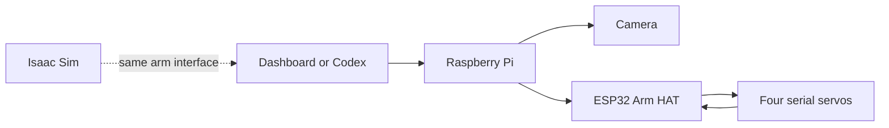

# co-arm

3D-printed four-joint camera arm that Codex can see through and move.

A Raspberry Pi handles the camera and commands. An ESP32 Arm HAT talks to four
serial servos. The Base turns through a 4:1 set of 3D-printed gears.

**Status:** working prototype. Codex has moved the real arm and captured the
desk through its camera. The dashboard, Pi code, ESP32 firmware, simulator,
Codex tools, and 12 printable parts are here. The last build details and public
demo media are still coming.

## Start here

- **Try the software:** [open the dashboard without hardware](docs/QUICKSTART.md).
- **Connect an existing arm:** [check the setup and connect it](docs/SETUP_WITH_CODEX.md#existing-arm-short-path).
- **Build your own:** start with the [parts and assembly guide](docs/ASSEMBLY.md).
  The bearing, fastener, print, wiring, and power details still need finishing.
- **See what is proven:** [status and evidence](docs/STATUS.md),
  [known limitations](docs/KNOWN_LIMITATIONS.md).

---

## Why I built it this way

I wanted Codex to do something physical, not just spit out servo angles. It
should be able to look at my desk, work out a move, move the arm, then look
again and see what happened.

The Pi handles the camera and the bigger commands. The ESP32 stays close to the
servos and handles the fast communication. The dashboard and Codex use the same
route to the arm, so I can test a move myself and let Codex use the exact same
system.

The Base uses a 4:1 gear set I printed. It trades some speed for more output
torque and finer movement. An early version tracked the Base by adding up
relative moves. That eventually lost the real position, so I switched to the
servo's own absolute multi-turn reading and kept a physical zero mark.

That failure shaped the rest of the project too: show the move first, run it,
then read the joints and camera again. Less guessing, more checking what the
real arm actually did.

---

## The build

| Part | Reference build |
| --- | --- |
| Joints | Base, Shoulder, Elbow, and Camera |
| Main servos | 3 x ST3215/STS-family serial-bus servos |
| Camera servo | SC09/SCS-family serial-bus servo |
| Base drive | 3D-printed 4:1 gear reduction |
| Main computer | Raspberry Pi 4 |
| Servo controller | ESP32 on Waveshare Bus Servo Driver HAT (A) |
| Camera | Raspberry Pi Camera Module 3 Wide / IMX708 |
| Arm lengths | 180 mm upper arm, 220 mm elbow-to-camera tip |
| Arm HAT firmware | `arm-hat-2.7.2` |

The Camera joint only aims the sensor. Shoulder and Elbow place it. Base turns
the whole arm around the desk.

---

## How it works



The dashboard and Codex both send moves to the Pi. The Pi works out the joint
targets and passes them to the ESP32. The ESP32 talks to the servos and sends
their positions back. The camera gives a separate look at what happened.

Codex gets useful arm actions such as **look**, **preview**, **move**, and
**release**. It does not need to build raw servo packets or know register
addresses. A preview does not move anything; it just shows the planned joint
targets and path before they are sent.

The simulator uses the same general route, so most of the software can be run
without the real arm connected.

---

## Repo

- [`software/dashboard/`](software/dashboard/) — the standalone arm dashboard.
- [`software/python/robot_gateway/`](software/python/robot_gateway/) — the Pi
  code for the arm and camera.
- [`software/firmware/`](software/firmware/) — the ESP32 Arm HAT firmware.
- [`software/python/arm_mcp/`](software/python/arm_mcp/) and
  [`software/plugin/`](software/plugin/) — the tools Codex uses to work with
  the arm.
- [`software/python/arm_sim/`](software/python/arm_sim/) — the Isaac Sim model
  and simulator bridge.
- [`software/operations/`](software/operations/) — setup, deployment, status,
  recovery, and build scripts.
- [`hardware/3mf/`](hardware/3mf/) — all 12 current printed parts, including
  both Base gears, the arm links, servo mounts, and camera pieces.
- [`hardware/`](hardware/README.md) — BOM and the rest of the mechanical and
  electrical build files.
- [`docs/`](docs/README.md) — setup, build notes, history, troubleshooting, and
  deeper technical details.
- [`docs/SETUP_WITH_CODEX.md`](docs/SETUP_WITH_CODEX.md) — the full path from a
  clean checkout to simulation or a real arm.

[`software/SOURCE_INDEX.json`](software/SOURCE_INDEX.json) is the quick map for
an agent or developer looking for a particular piece of source.

---

## Run it

The [quickstart](docs/QUICKSTART.md) gets the dashboard running locally with
Python, Node, and pnpm. You can explore it before connecting an arm; movement
and camera controls need a configured gateway.

For the next step, use the full setup guide:

- [Run the source checks](docs/SETUP_WITH_CODEX.md#1-clone-and-validate-without-hardware).
- [Run the Isaac Sim arm](docs/SETUP_WITH_CODEX.md#3-run-the-isaac-sim-arm).
- [Connect an existing real arm](docs/SETUP_WITH_CODEX.md#existing-arm-short-path).

Isaac Sim and the ESP32 build tools are separate installs. The dashboard does
not include a fake camera feed or a simulator that runs in the browser.

---

## Put Codex on it

Open the repo in Codex and paste this:

```text
Help me run co-arm. Read AGENTS.md and docs/SETUP_WITH_CODEX.md first. Check
whether I am using source only, Isaac Sim, or the real arm, then take the
matching path. For a configured real arm, read its current state, show the move,
run it, and check the joints or camera afterward. Treat the physical task I ask
for as the go-ahead for its normal steps. Keep updates short and stop only if a
real fault or missing physical fact changes the job.
```

The external MCP/plugin is the supported Codex connection. It talks to the same
Pi arm service as the dashboard.

---

## Build the real arm

Start with [`docs/ASSEMBLY.md`](docs/ASSEMBLY.md) and
[`docs/COMMISSIONING.md`](docs/COMMISSIONING.md).

The short version:

1. print and assemble the mechanism, including the 4:1 Base gears;
2. wire the Pi, camera, Arm HAT, and four servos;
3. give every servo the correct ID;
4. mark the physical Base zero;
5. calibrate one joint at a time;
6. test small moves before coordinated motion;
7. connect the dashboard or Codex after the arm works normally.

The reference software and all 12 current printable parts are included. To
finish the build package, I still need to add:

- the large Base bearing details;
- final print settings and the screw/insert list;
- an as-built wiring diagram and pinout;
- the final power details;
- assembly photos, a hero photo, and a short real-arm demo.

See [`docs/STATUS.md`](docs/STATUS.md) for what has actually been checked on the
reference arm.

---

## License

Made by [over-TT](https://github.com/over-TT). Available for noncommercial use:

- **Software and firmware:** [PolyForm Noncommercial 1.0.0](LICENSE).
- **Printable designs, documentation, and media:** [CC BY-NC 4.0](LICENSES/CC-BY-NC-4.0.txt).

Commercial use requires separate permission. See [Licensing](LICENSING.md) for
the exact scope, attribution, and third-party terms. This is source-available
software, not an OSI open-source release.
