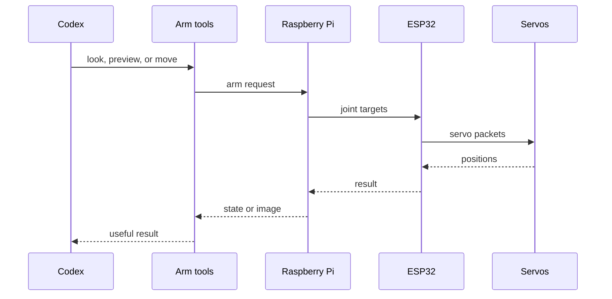

# Use co-arm with Codex

Codex talks to the same Raspberry Pi arm service as the dashboard. It does not
talk straight to the servos. The MCP server is in `software/python/arm_mcp/`,
and the repo-local Codex plugin is in `software/plugin/`.

Register `python -m arm_mcp` with the project virtual environment and the four
local settings shown in `SETUP_WITH_CODEX.md`. Set
`ARM_EXPECTED_BACKEND=sim` for Isaac or `real` for the physical arm so Codex
cannot accidentally use the wrong one. Start a new Codex task after changing
the plugin or MCP setup.

## Arm tools

| Tool | What it does | Moves the arm? | What you get back |
| --- | --- | --- | --- |
| `arm_state` | Reads joint positions and current arm state | No | The latest joint/state reading |
| `arm_scene` | Draws the arm and camera direction from the joint readings | No | A calculated side view |
| `arm_plan` | Previews one pose | No | The joint targets and planned path |
| `arm_apply_plan` | Runs that previewed pose | Yes | Command result; read state to check arrival |
| `arm_apply_and_look` | Runs one pose, waits for the joints, then takes a picture | Yes | Joint result plus camera image |
| `arm_plan_sequence` | Previews two to eight waypoints | No | The whole route before it moves |
| `arm_apply_sequence` | Runs that waypoint route | Yes | A result for every waypoint |
| `arm_move` | Sends a direct joint move | Yes | Command result |
| `arm_look` | Takes a survey or detail picture | No | Camera image and capture details |
| `arm_detail` | Crops an existing full-resolution picture | No | A closer crop of the same image |
| `arm_set_base_zero` | Sets zero after the physical Base marks are lined up | No | The new Base zero |
| `arm_release` | Turns servo torque off | The arm goes limp | Release result; hold Shoulder and Elbow because they can sag |
| `arm_floor_guard` | Turns the desk-floor check on or off | No | The new setting |

`arm_plan` and `arm_plan_sequence` do not move anything. Plans are short-lived
and can be used once. If the arm moved or the plan got old, preview it again.

If the reply to a move gets lost, Codex does not blindly send the move again.
It reads the arm first, because the first move may already have happened.

For one move ending in a picture, use `arm_apply_and_look`. For a route, preview
the whole sequence once and let the Pi run it. To push or touch something, one
waypoint must actually reach it and move in the useful direction.

## How to read the result

A server reply is not a joint position, and a joint position is not a camera
image. Check the thing that matters for the task.

## Public standalone runtime

The standalone backend runs the dashboard on the local computer and connects it
to either Isaac Sim or the real Pi. Codex uses the external MCP/plugin; there is
no separate chat box built into the dashboard.

## Context and memory

The repo can remember stable things such as geometry and joint names. It cannot
tell Codex where the arm is right now. Start real work with `arm_state` and a
current picture when the task needs one.

## Using it on the real arm

- For a requested arm task, use the normal path: read state, preview, move, then
  check the joints or camera. Do not keep asking the user for the same task.
- Torque off means the raised links can sag. Hold them before release.
- If the Base loses its position, line up its physical zero mark before using
  **Set zero here**.
- STOP, an offline controller, stale joints, or a refused path are real faults;
  fix the specific problem instead of bypassing the Pi or ESP32.
- Use the arm tools instead of making raw serial or register commands.

See [AI context](AI_CONTEXT.md), [Control and safety](CONTROL_AND_SAFETY.md), and
[Vision](VISION.md) for the full operating contract.
