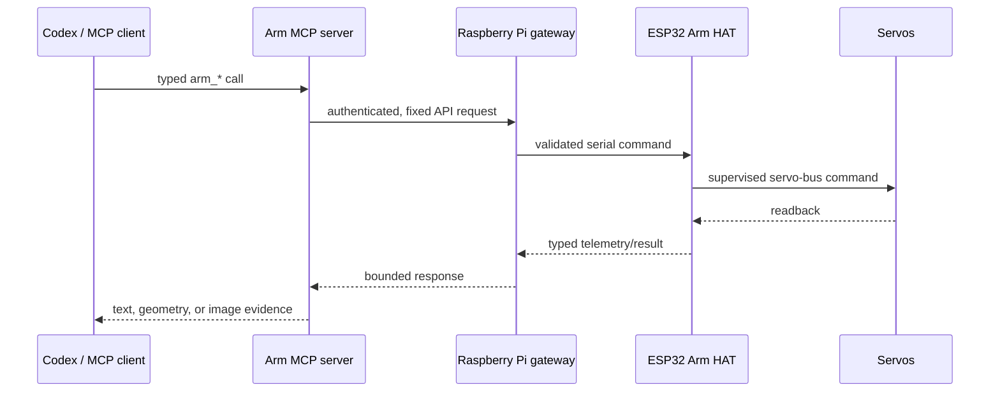

# Codex and MCP integration

co-arm exposes one typed Model Context Protocol (MCP) server so an agent uses
the same Raspberry Pi policy boundary as the dashboard. The MCP process is a
thin adapter: it does not implement a second motion controller and does not
open the servo bus directly.

## Architecture



The canonical implementation is intended to be exported under `software/mcp/`
after source scope and licensing are confirmed. Configure its gateway address
and credential file locally. Do not commit tokens, private
network addresses, machine-specific absolute paths, generated account state,
or chat databases.

New MCP tools are discovered when a client task/session starts. Changing the
server source or plugin configuration does not hot-load an already-running
task, and changing gateway code does not hot-load the Pi service. Restart the
specific process after a reviewed deployment, then verify with a non-motion
call.

## The nine typed Arm tools

| Tool | Purpose | Motion? | What success proves |
| --- | --- | --- | --- |
| `arm_state` | Read measured joint angles, calibrated limits, connection, STOP and floor-guard state | No | Telemetry returned at that time |
| `arm_scene` | Render the measured 2D radial/height geometry and camera ray | No | Calculated geometry from measured angles, not camera content |
| `arm_plan` | Preview direct joint targets or planar tip IK; resolve limits, sweep and clearance | No | A short-lived proposal was prepared without torque |
| `arm_apply_plan` | Consume the exact reviewed plan once after fresh Pi checks | Yes | Command accepted, not physical arrival |
| `arm_move` | Send one direct coordinated absolute or relative joint target set | Yes | Command accepted/clamped, not physical arrival |
| `arm_look` | Take a new camera capture; return survey or full-frame detail plus near-capture pose | No arm motion | The returned pixels and metadata from that capture |
| `arm_detail` | Crop a bounded region from a retained full-resolution capture | No | A transformed view of the same retained pixels; no new photo |
| `arm_release` | Request torque off for all joints | Electrical state change | The request/result; support the arm because it may sag |
| `arm_floor_guard` | Enable or disable the Pi floor keep-out plane | Policy change | The reported guard setting; disabling requires explicit operator intent |

### `arm_plan`

Accepted pose inputs are any named joint targets (`base`, `shoulder`, `elbow`,
`camera`) or a planar pair (`radial_mm`, `height_mm`). Tip IK owns Shoulder and
Elbow, so those two joint targets cannot be supplied alongside the planar pair;
Base and Camera may accompany it. The IK branch preference is `nearest`, `up`,
or `down`.

Plan output includes exact measured and resolved poses, warnings, lowest swept
clearance, a measured-solid/planned-dashed scene, expiry, and an opaque one-use
identifier plus SHA-256 digest. Preview never takes torque.

### `arm_apply_plan`

Apply requires the exact identifier and digest returned by `arm_plan`. The Pi
rechecks STOP, connection, bus, controller boot, telemetry freshness,
configuration, floor policy, pending goals, and start-pose drift. A plan is
short lived (currently 30 seconds), single use, and is unavailable after an
apply attempt. Read `arm_state` afterward to prove arrival.

### `arm_move`

Supply every joint that should start together in one call. `relative=true`
resolves offsets against fresh measured positions; it is refused when a needed
measurement is missing. An optional wait is bounded to five seconds, but even a
wait is not a substitute for measured arrival. This direct compatibility path
does not provide the same explicit reviewed sweep artifact as plan/apply.

### `arm_look` and `arm_detail`

`arm_look` defaults to a bandwidth-friendly survey while retaining its full
source. Full-frame detail should be requested only when it is genuinely useful.
The response includes an upright JPEG, capture metadata, and a near-capture arm
pose when available.

`arm_detail` accepts normalized crop coordinates for a retained source. The
crop must remain in the image, span at least 5% on each axis, and cover at most
half the source area. Retention is intentionally bounded and ephemeral; if the
source is no longer available, take a new survey.

## Recommended agent control loop

For a movement that benefits from review:

```text
arm_state
-> arm_scene
-> arm_plan
-> inspect exact pose, sweep, clearance, warnings
-> arm_apply_plan
-> settle
-> arm_state (measured arrival)
```

For visual inspection, extend that loop as described in
[`VISION.md`](VISION.md). A useful image often requires more than one bounded
viewpoint; the operator's request to inspect a desk object can authorize those
viewpoint corrections, but it does not waive live telemetry, floor, sweep, or
STOP checks.

## Embedded chat authority modes

The reference application separated three kinds of authority:

| Mode | Project writes | General web | Live Arm tools |
| --- | ---: | ---: | ---: |
| Drive | No | No | Yes |
| Build | Yes | No | No |
| Alliance | Yes | Yes | Yes |

This separation prevents a broad code-editing session from silently inheriting
physical authority. A reimplementation should preserve the distinction even if
the product names change. Any automatic approval mechanism must allow only the
known Arm server and explicitly enumerated tool/argument shapes; a future tool
must inherit no authority by name alone.

## Context and memory

The checked-in context should contain stable project facts, coordinate
conventions, safety rules, and evidence boundaries. It must not contain live
pose, live torque state, controller/session/frame identifiers, private paths,
network addresses, credentials, account metadata, or personal information.

Private operator preferences may be injected from a bounded local store at
runtime. The reference implementation rejects likely credentials and dynamic
hardware statements before saving operator memory. A separate, allowlisted,
read-only memory summary can be injected without copying authentication or
session databases. The public export contains no private memory.

Always refresh hardware truth with `arm_state`; remembered state is not
telemetry. See [`AI_CONTEXT.md`](AI_CONTEXT.md) for the public agent contract.

## Local configuration pattern

Keep deployment-specific values outside version control:

```text
Arm MCP process
  gateway URL      <- local environment/configuration
  gateway token    <- local credential file
  retained frames  <- local bounded runtime directory
  project context  <- checked-in public docs
  operator context <- optional private runtime state
```

No installed plugin configuration is included in this documentation release.
When a portable template is added, generate a separate local configuration
that points to the checkout's MCP entrypoint and local credential file. Review
it before starting a new client task.

## Approval and failure policy

- Prefer plan/apply for physical viewpoint or manipulator moves.
- Never disable the floor guard unless the operator explicitly requests and
  owns the below-floor operation.
- Never clear an operator STOP autonomously.
- Never flash firmware or restart a torque-holding controller without explicit
  intent and mechanical support.
- Never replace a typed Arm tool with an improvised raw HTTP/serial command.
- Treat tool errors as actionable state, not permission to bypass a layer.
- Report command acceptance, measured arrival, image evidence, and subjective
  interpretation as separate claims.

## Source status

The MCP server behavior is fully documented, but its source and tests are
pending the owner's software-scope and license decisions. Local plugin
registration, credentials, endpoint configuration, and all account/session
state remain excluded. The dashboard/backend also needs standalone packaging;
see [`../software/README.md`](../software/README.md).
