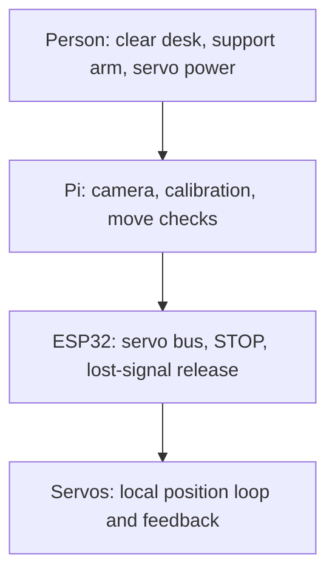

# Control notes

co-arm is a real desk arm with gravity-loaded links and printed gears. The main
physical facts are simple: keep a way to remove servo power, support a raised
link before releasing it, and keep the intended path clear. The software checks
help, but they cannot see every cable, tool, or object on the desk.

## Who does what

Each layer has a different job. A dashboard message does not replace reading
the servos, and a servo position does not replace looking at the real desk.

## Physical basics

- Keep a tested, reachable method to remove **servo power**. A software STOP is
  useful but is not an independently wired emergency stop.
- Support the Shoulder/Elbow structure before releasing torque, rebooting a
  controller while joints are held, or manually repositioning the arm. Torque
  off can cause gravity-driven motion.
- Clear people, cables, tools, and fragile objects from the full swept volume,
  not only the destination.
- Commission one mechanically unloaded or supported joint at a time and begin
  with small, slow moves.
- Never discover travel limits by driving into a hard stop. Record conservative
  manual endpoints with torque off and apply an inward margin.
- If electrical torque state is `unknown`, do not touch or assume the arm is
  limp. Remove servo power first.
- Do not flash the ESP32 while both its Pi UART and a USB host can drive the same
  host serial lines. Isolate the competing connection before flashing.

## Firmware safety limits

The ESP32 is the final electrical authority. Current Arm HAT firmware 2.7.2 uses these
fixed supervision limits:

| Mechanism | Current limit / behavior |
| --- | --- |
| Host watchdog | `750 ms` without a fresh heartbeat revokes motion authority |
| Torque/hold lease | Accepted range `100..2000 ms` |
| Maximum held set | Four servos |
| Pi heartbeat cadence | Approximately `200 ms` |
| Pi hold lease | `2000 ms`, normally renewed about every `800 ms` |
| Boot behavior | Torque-off broadcast is attempted; startup remains disarmed |
| Deliberate STOP | Clears holds/goals, commands torque off, and remains latched until an inspected reset |

`HEARTBEAT` and `HOLD_SET` are supervised authority, not merely status traffic.
When the watchdog expires, firmware drops active lease/hold authority and
drives its torque-off recovery. The current watchdog path is designed to remove
authority without turning every transient serial delay into a permanent
operator STOP. A deliberate operator STOP remains latched.

Before enabling torque for a servo, firmware records an outstanding torque-off
obligation. That obligation is cleared only by addressed readback proving that
servo is off. If torque-off cannot be confirmed, the safe report is `unknown`,
and firmware can retain/retry the obligation and block further motion.

Firmware motion-policy values such as speed, acceleration, tolerance, and
execution budget may be supplied by the Pi, but compile-time ceilings prevent a
host from disabling the watchdog, lease, boot torque-off, or STOP behavior.

## STOP, release, and reset

These actions are different:

- **STOP** cancels outstanding goals, revokes torque authority, requests torque
  off, and records that the operator deliberately stopped the arm.
- **Release** requests an empty hold set and torque off. The mechanism becomes
  limp and may sag; it is not a substitute for STOP during an abnormal event.
- **Clear STOP / reset** is allowed only after inspection, a fresh host
  heartbeat, and the controller's torque-off procedure. Reset does not restore
  the previous goal or lease; authority must be requested again.
- **Physical power cut** removes servo-rail energy independently of the software
  stack. Use it whenever software state is unreliable or the arm is behaving
  unexpectedly.

An operator STOP must never be cleared autonomously. Clearing it requires an
explicit decision after the physical cause has been checked.

## What the Pi checks before a move

The Pi is the high-level motion authority and enforces:

- authenticated, typed requests;
- stable controller identity and current boot continuity;
- fresh per-joint telemetry;
- declared servo family and joint calibration;
- software zero, direction, gear ratio, and calibrated travel limits;
- native multi-turn truth for Base;
- floor protection for Shoulder and Elbow;
- one coordinated hold set for the joints being driven;
- bounded retries for accepted absolute goals that stop short;
- one serialized motion lane so plan validation cannot race a direct move.

The Pi does not replace the firmware fail-safes. It renews a short hold lease;
if the process, transport, or heartbeat fails, firmware authority expires.

## Floor keep-out guard

The default keep-out plane is `40 mm` above the physical floor reference. Only
Shoulder and Elbow affect side-view height. Base yaw and Camera tilt cannot move
the endpoint toward the floor and are therefore governed only by their own
calibrated travel.

The guard checks the lower of the Elbow and distal tip, not just the tip. It
also checks the **entire independently timed Shoulder/Elbow sweep**. The two
servos are commanded close together but are not guaranteed to progress in
lockstep, so the possible path is the full rectangle between their start and
target angles. Checking only a straight interpolation could miss a collision.

Behavior differs by interface:

- A direct move is pulled back to the nearest representable safe boundary and
  reports which joint was clamped.
- A reviewed plan fails closed if its swept region crosses the allowed plane.
- If the arm begins below the nominal plane, the guard permits only a path that
  does not go lower and ratchets protection upward as the arm exits.
- Turning the guard off is an operator-only exception. It is never an agent's
  workaround for a clamp or inconvenient plan.

The floor guard knows only the configured side-view floor. It does not sense
walls, people, loose cables, a shifted base, or objects on the desk.

## Preview, then move

Use plan/apply whenever numeric or spatial review is useful.

### Preview

Preview takes no torque and causes no motion. It requires:

- controller and servo bus online;
- STOP clear and motion state ready;
- a stable controller boot;
- a fresh heartbeat (currently no older than `2000 ms`);
- fresh required servo packets (currently no older than `250 ms`);
- fresh native signed Base-frame evidence when Base participates;
- no unresolved previous goal;
- calibrated, representable targets.

The Pi resolves any IK, applies travel limits, quantizes goals once, checks the
full swept floor clearance, and binds the result to a configuration digest.

### Apply

The current plan is valid for `30 seconds`, is consumed once, and permits up to
`2 deg` start-pose drift. Apply repeats the live health and telemetry checks,
requires the same controller boot and configuration, compares the exact digest,
revalidates the live sweep, and sends the already reviewed raw goals. A changed,
expired, moved, failed, or replayed plan must be prepared again.

An apply response proves command acceptance only. Verify measured arrival with
live state. If the next action depends on a stable image, also allow the arm to
settle before capture.

## Live Follow boundary

Live Follow is a separate deliberate REAL-only mode for Shoulder and Elbow. It
does not bypass the Pi or Arm HAT. The browser coalesces input while a separate
strict heartbeat renews the lease; the Pi dispatches no faster than 20 Hz and
the controller writes/verifies both goals together. Sessions end after at most
30 seconds, and a 400 ms input dead-man stops stale intent from continuing.

Each joint is bounded to raw speed `1..2400`, raw acceleration `1..50`, and a
start-relative travel span `1..90 deg`, further intersected with calibrated
reach and the floor guard. These bounds do not sense obstacles, cables, load,
overshoot, self-contact, or people.

## Base continuity and re-home

The Base uses the ST3215's native signed extended-position coordinate. The
ESP32 validates that volatile coordinate for continuity and exposes it through
the existing odometer-shaped status contract. It is trustworthy only while the
controller can bind it to one continuous boot and valid native samples.

After a real continuity loss:

1. Stop and support the arm.
2. Remove or confirm torque off.
3. Align the Base to its physical zero mark.
4. Use **Set zero here** through the calibrated workflow.
5. Recheck a small positive move, return to zero, a small negative move, and
   return again before relying on larger motion.

Never reconstruct the output revolution from a single-turn reading and never
copy a previous live angle into a new boot as truth.

## Using Codex

- Reading state, rendering a scene, and planning are non-motion operations.
- A physical inspection request may authorize bounded camera viewpoint moves
  after telemetry and guards are healthy, but each move still obeys plan/apply.
- Other motion, guard disable, STOP reset, firmware flashing, and hardware
  changes require explicit operator intent.
- Agents must use the typed Arm tools. They must not invent raw HTTP, serial,
  register, or shell control paths to bypass policy.
- A target is not arrival, geometry is not pixels, and a photo is not a safety
  sensor.

## Pre-motion checklist

- Physical servo-power cut reachable and tested
- Arm mechanically supported where gravity could act
- Full intended sweep clear
- Controller and bus online
- Required joints online with fresh, trusted telemetry
- Torque state known
- STOP clear
- Floor guard enabled unless the operator explicitly owns an exception
- Base truth valid, or Base excluded from the move
- Plan numbers, sweep, clearance, and warnings reviewed

If any item is unknown, do not move until that specific condition is resolved.

## What software tests do not tell you

Unit tests can prove watchdog arithmetic, plan invalidation, floor geometry,
schema rejection, and error handling. They cannot prove a physical power cut,
real torque removal, STOP latency, mechanical clearance, structural strength,
load capacity, or safe behavior under a real obstruction. Record those as
separate controlled hardware tests.
