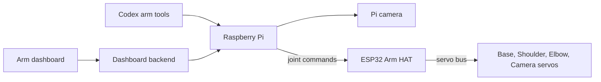

# Software architecture

This page shows how the dashboard, Codex, Pi, ESP32, camera, and servos fit
together.

## Why I split it this way

The Pi is good at Linux, networking, Python, and the camera. The ESP32 is better
placed for the fast servo-bus work. Keeping those jobs separate means a slow
browser or camera request does not have to become servo timing.

The dashboard and Codex both use the same Pi route. I can try a move myself in
the dashboard, then let Codex use the same system instead of maintaining a
second robot controller just for AI.

## System at a glance

co-arm is a four-joint desk arm with a camera at the distal end. Control is
split deliberately across three computers:



| Part | Job |
| --- | --- |
| Dashboard / Codex | Shows the arm and asks it to look, preview, or move |
| Laptop backend | Serves the dashboard and selects the simulator or real arm |
| Raspberry Pi | Runs the camera, stores calibration, and works out joint targets |
| ESP32 Arm HAT | Talks to the four servos quickly and reads their positions back |
| Smart servos | Move each joint and report their local state |

Both the dashboard and Codex reach the arm through the Pi. Neither needs to
build raw servo packets.

## The four driven joints

1. **Base** — yaw around the vertical axis. The reference build uses an
   ST3215-family servo and 3D-printed 52:13 gears for 4:1 reduction. Firmware
   reads the servo's absolute multi-turn position.
2. **Shoulder** — raises or lowers the upper arm and participates in planar
   inverse kinematics.
3. **Elbow** — changes distal reach and participates in planar inverse
   kinematics.
4. **Camera** — tilts the end-mounted camera. It is calibrated and driven like
   the other joints but is excluded from the arm endpoint IK chain.

Servo-bus identifiers and servo families are configuration, not discoverable
mechanical truth. A responding device must still be matched to the printed
servo label and physical joint during commissioning.

## Angles and arm dimensions

All public motion tools use calibrated **servo degrees**. The 2D scene uses a
radial/height plane measured in millimetres:

- Base pivot height: `60 mm`
- Upper arm length: `180 mm`
- Elbow-to-camera/tool-tip distance: `220 mm`
- Default floor keep-out height: `40 mm`
- Shoulder servo `0 deg`: upper arm points straight up
- Negative Shoulder: tilts the upper arm forward
- Elbow servo `0 deg`: folded mid-travel reference
- Elbow servo `90 deg`: arm is straight when Shoulder is `0 deg`
- Camera servo `0 deg`: optical ray follows the forearm
- Positive Camera: rotates the view downward

The dashboard/MCP model converts servo angles as follows:

```text
shoulder_model = shoulder_servo + 90 deg
elbow_model    = elbow_servo - 90 deg
forearm_angle  = shoulder_model + elbow_model
camera_ray     = forearm_angle - camera_servo
```

With `h = 60`, `L1 = 180`, and `L2 = 220` millimetres:

```text
elbow.x = L1 * cos(shoulder_model)
elbow.z = h  + L1 * sin(shoulder_model)
tip.x   = elbow.x + L2 * cos(forearm_angle)
tip.z   = elbow.z + L2 * sin(forearm_angle)
```

The physical camera is mounted inverted. The Pi applies a 180-degree transform
so newly delivered images are upright. The Base affects azimuth but not the 2D
height calculation; the Camera joint affects the optical ray but not endpoint
position.

## Base: native absolute multi-turn control

The current firmware line retains the native Mode-0 design introduced in 2.4
and is exported as `arm-hat-2.7.2`:
absolute multi-turn control:

1. The ST3215 is configured for its native extended-position phase and exposes
   one signed absolute motor coordinate while its volatile frame is intact.
2. The ESP32 validates fresh native samples and rejects evidence of a reset or
   continuity collapse; it preserves the older odometer-shaped wire contract
   without running the retired relative-step loop.
3. The Pi converts a calibrated output-joint angle through the external gear
   ratio into one signed absolute motor destination, and the servo's own
   Mode-0 position loop closes it.
4. Repeating the same goal is idempotent; a new goal replaces the previous
   destination instead of queuing relative hops.

The native extended coordinate is not persistent through every servo power or
continuity loss. When Base truth is unknown, stop, support the mechanism, align
the physical Base zero mark, and use the calibrated **Set zero here** workflow.
Never infer the missing output revolution from a single-turn reading. A Pi-only
process restart may preserve Base truth only when the still-running controller
proves the same boot and valid native frame.

## Command paths

The gateway exposes direct compatibility control plus reviewed plan/apply and
sequence paths. A separate bounded Live Follow mode exists only for deliberate
REAL-arm sessions.

### Plan/apply (preferred)

`arm_plan` is motionless. The Pi obtains a fresh measured snapshot, resolves
joint targets or planar tip IK, quantizes once, applies calibrated limits,
checks Base continuity, evaluates the complete Shoulder/Elbow sweep, and
returns:

- measured and resolved poses;
- a solid measured arm and dashed planned arm;
- warnings and lowest swept clearance;
- a short-lived, one-use plan identifier and digest.

The current implementation gives a plan a 30-second lifetime. Applying it
consumes it once. Before execution, the Pi rechecks controller boot continuity,
fresh telemetry, STOP, bus state, pending movement, calibration/configuration,
floor protection, plan digest, and start-pose drift (currently limited to
`2 deg`). A failed or replayed apply requires a new plan.

Plan acceptance is not arrival proof. Read measured state after the move.

### Sequence plan/apply

`arm_plan_sequence` resolves two to eight ordered waypoints without motion and
binds their carried-forward poses, segment sweeps, warnings, and clearance into
one digest. `arm_apply_sequence` revalidates live safety and proves each measured
arrival before dispatching the next waypoint. A returned route receipt is still
not visual proof of an object-level outcome.

### Live Follow

Live Follow controls only Shoulder and Elbow. The browser coalesces pointer
intent while an independent heartbeat maintains the Pi lease. The Pi
dispatches at most 20 Hz, the Arm HAT writes both goals as one grouped operation,
and fresh feedback is returned. Sessions are REAL-only, deliberate, and limited
to 30 seconds with a 400 ms input dead-man. Raw speed is limited to `1..2400`,
raw acceleration to `1..50`, and start-relative travel to `1..90 deg` per joint.
These are controller settings, not calibrated degrees per second.

### Direct move (compatibility)

`arm_move` sends one coordinated set of named joint targets and returns while
the joints may still be travelling. The Pi clamps calibrated travel and applies
its direct floor policy. This path remains useful for established workflows,
but plan/apply is the default when sweep review matters.

## Evidence path

The Pi camera is independent of the geometry model:

```text
measured telemetry -> arm_scene -> calculated geometry
camera capture      -> arm_look  -> real pixels
retained capture    -> arm_detail -> crop of the same pixels
```

`arm_scene` can prove the calculated pose and camera ray, not what is visible.
`arm_look` can prove only what appears in that capture. `arm_detail` makes no
movement and takes no new photograph; it crops a retained source image.

## State and persistence

Persisted arm configuration includes joint mapping, servo family, zero,
direction, travel limits, gear ratio, geometry, and related revision data.
Runtime state includes measured positions, torque authority, STOP, connection,
bus health, camera frames, plans, and Base continuity. Runtime state must never
be treated as durable memory.

Credentials and endpoint addresses belong in local deployment configuration,
not source control. Camera captures are bounded runtime evidence and are not
automatically project media.

## Public source layout

`software/` is the standalone project root:

- `software/dashboard/` — React/Vite Arm dashboard and tests
- `software/python/web_backend/` — loopback FastAPI dashboard runtime
- `software/python/robot_gateway/` — Raspberry Pi gateway and tests
- `software/python/arm_mcp/` — typed MCP server
- `software/python/arm_sim/` — core Isaac digital twin, bridge, and tests
- `software/firmware/` — Arm HAT, shared controller library, and host-side tests
- `software/plugin/` — repo-local Codex marketplace and portable skills
- `software/operations/` — service templates, deployment/diagnostic helpers,
  and simulator launcher

The FastAPI runtime can serve a built dashboard on loopback. Without a locally
configured gateway, REAL-arm routes fail closed. The supported agent path is
the external MCP/plugin plus the repository setup contract; the public runtime
does not bundle an embedded Codex binary, account, memory, or chat service. See
[`SOURCE_RELEASE_PLAN.md`](SOURCE_RELEASE_PLAN.md) for the explicit included and
excluded boundary.

## Proof boundary

- Source inspection proves what the checked-in implementation intends.
- Tests prove the tested software branch under their fixtures.
- A successful build proves compilation, not installation.
- A gateway health response proves that process path, not servo readiness.
- Live state proves telemetry at that moment.
- A target or accepted plan does not prove arrival.
- A camera image proves only its visible content.
- Physical reach, clearance, STOP latency, load, temperature, and repeatability
  require controlled tests on the assembled arm.
