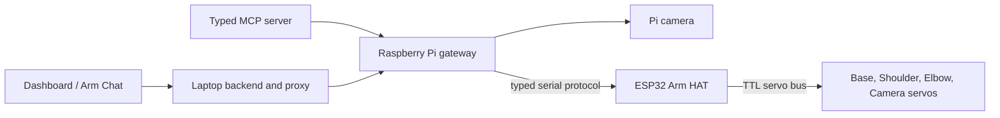

# Software architecture

This document describes the current reference architecture of co-arm without
including deployment addresses, credentials, machine-specific paths, live pose
data, or device identifiers.

## System at a glance

co-arm is a four-joint desk arm with a camera at the distal end. Control is
split deliberately across three computers:



The split is intentional:

| Plane | Owns | Does not own |
| --- | --- | --- |
| Dashboard / agent client | Drafting targets, displaying telemetry, asking for captures, explicit plan review | Servo timing, safety truth, raw bus access |
| Laptop backend | Authenticated proxying, embedded chat sessions, attachment handling, local context injection | Final motion authorization or electrical torque control |
| Raspberry Pi gateway | Authentication, calibration, degree-to-encoder conversion, limits, kinematics, floor policy, plan/apply, camera evidence | Low-level servo packet timing |
| ESP32 Arm HAT | Serial protocol, 1 Mbps servo-bus timing, native Base odometry, watchdog, torque authority, STOP, boot torque-off, readback supervision | User interface, camera interpretation, high-level task planning |
| Smart servos | Position control and local feedback | System-wide collision awareness or task intent |

The browser and an AI agent therefore use the same policy boundary. Both reach
the arm through the Pi; neither bypasses calibrated limits, Base truth checks,
or the floor guard.

## The four driven joints

1. **Base** — yaw around the vertical axis. The reference build uses an
   ST3215-family servo through 4:1 external gearing and the firmware 2.4 native
   absolute multi-turn path.
2. **Shoulder** — raises or lowers the upper arm and participates in planar
   inverse kinematics.
3. **Elbow** — changes distal reach and participates in planar inverse
   kinematics.
4. **Camera** — tilts the end-mounted camera. It is calibrated and driven like
   the other joints but is excluded from the arm endpoint IK chain.

Servo-bus identifiers and servo families are configuration, not discoverable
mechanical truth. A responding device must still be matched to the printed
servo label and physical joint during commissioning.

## Coordinate and geometry contract

All public motion tools use calibrated **servo degrees**. The 2D scene uses a
radial/height plane measured in millimetres:

- Base pivot height: `60 mm`
- Upper arm length: `180 mm`
- Elbow-to-camera/tool-tip distance: `220 mm`
- Default floor keep-out height: `40 mm`
- Shoulder servo `0 deg`: upper arm points straight up
- Negative Shoulder: tilts the upper arm forward
- Elbow servo `0 deg`: folded mid-travel reference
- Elbow servo `90 deg`: arm is straight when Shoulder is `0 deg`
- Camera servo `0 deg`: optical ray follows the forearm
- Positive Camera: rotates the view downward

The dashboard/MCP model converts servo angles as follows:

```text
shoulder_model = shoulder_servo + 90 deg
elbow_model    = elbow_servo - 90 deg
forearm_angle  = shoulder_model + elbow_model
camera_ray     = forearm_angle - camera_servo
```

With `h = 60`, `L1 = 180`, and `L2 = 220` millimetres:

```text
elbow.x = L1 * cos(shoulder_model)
elbow.z = h  + L1 * sin(shoulder_model)
tip.x   = elbow.x + L2 * cos(forearm_angle)
tip.z   = elbow.z + L2 * sin(forearm_angle)
```

The physical camera is mounted inverted. The Pi applies a 180-degree transform
so newly delivered images are upright. The Base affects azimuth but not the 2D
height calculation; the Camera joint affects the optical ray but not endpoint
position.

## Base: native absolute multi-turn control

Firmware 2.4 replaced the earlier relative-step approach with native Mode-0
absolute multi-turn control:

1. The ST3215 is configured for its native extended-position phase and exposes
   one signed absolute motor coordinate while its volatile frame is intact.
2. The ESP32 validates fresh native samples and rejects evidence of a reset or
   continuity collapse; it preserves the older odometer-shaped wire contract
   without running the retired relative-step loop.
3. The Pi converts a calibrated output-joint angle through the external gear
   ratio into one signed absolute motor destination, and the servo's own
   Mode-0 position loop closes it.
4. Repeating the same goal is idempotent; a new goal replaces the previous
   destination instead of queuing relative hops.

The native extended coordinate is not persistent through every servo power or
continuity loss. When Base truth is unknown, stop, support the mechanism, align
the physical Base zero mark, and use the calibrated **Set zero here** workflow.
Never infer the missing output revolution from a single-turn reading. A Pi-only
process restart may preserve Base truth only when the still-running controller
proves the same boot and valid native frame.

## Command path

There are two motion interfaces.

### Plan/apply (preferred)

`arm_plan` is motionless. The Pi obtains a fresh measured snapshot, resolves
joint targets or planar tip IK, quantizes once, applies calibrated limits,
checks Base continuity, evaluates the complete Shoulder/Elbow sweep, and
returns:

- measured and resolved poses;
- a solid measured arm and dashed planned arm;
- warnings and lowest swept clearance;
- a short-lived, one-use plan identifier and digest.

The current implementation gives a plan a 30-second lifetime. Applying it
consumes it once. Before execution, the Pi rechecks controller boot continuity,
fresh telemetry, STOP, bus state, pending movement, calibration/configuration,
floor protection, plan digest, and start-pose drift (currently limited to
`2 deg`). A failed or replayed apply requires a new plan.

Plan acceptance is not arrival proof. Read measured state after the move.

### Direct move (compatibility)

`arm_move` sends one coordinated set of named joint targets and returns while
the joints may still be travelling. The Pi clamps calibrated travel and applies
its direct floor policy. This path remains useful for established workflows,
but plan/apply is the default when sweep review matters.

## Evidence path

The Pi camera is independent of the geometry model:

```text
measured telemetry -> arm_scene -> calculated geometry
camera capture      -> arm_look  -> real pixels
retained capture    -> arm_detail -> crop of the same pixels
```

`arm_scene` can prove the calculated pose and camera ray, not what is visible.
`arm_look` can prove only what appears in that capture. `arm_detail` makes no
movement and takes no new photograph; it crops a retained source image.

## State and persistence

Persisted arm configuration includes joint mapping, servo family, zero,
direction, travel limits, gear ratio, geometry, and related revision data.
Runtime state includes measured positions, torque authority, STOP, connection,
bus health, camera frames, plans, and Base continuity. Runtime state must never
be treated as durable memory.

Credentials and endpoint addresses belong in local deployment configuration,
not source control. Camera captures are bounded runtime evidence and are not
automatically project media.

## Planned source layout

The documentation repository reserves implementation folders by responsibility:

- `software/firmware/` — ESP32 sketch and Arm HAT protocol/controller library
- `software/gateway/` — Raspberry Pi API, serial client, calibration, motion,
  safety policy, and camera provider
- `software/mcp/` — canonical typed Arm MCP server
- `software/dashboard/` — Arm Lab and Arm Chat React modules

No executable source has been copied into those folders yet. The owner must
confirm source scope and licensing before that happens. See
[`../software/README.md`](../software/README.md) for the current boundary and
[`SOURCE_RELEASE_PLAN.md`](SOURCE_RELEASE_PLAN.md) for the allowlisted export
plan. The dashboard and backend originated in a larger application and do not
yet form a standalone one-command build.

## Proof boundary

- Source inspection proves what the checked-in implementation intends.
- Tests prove the tested software branch under their fixtures.
- A successful build proves compilation, not installation.
- A gateway health response proves that process path, not servo readiness.
- Live state proves telemetry at that moment.
- A target or accepted plan does not prove arrival.
- A camera image proves only its visible content.
- Physical reach, clearance, STOP latency, load, temperature, and repeatability
  require controlled tests on the assembled arm.
